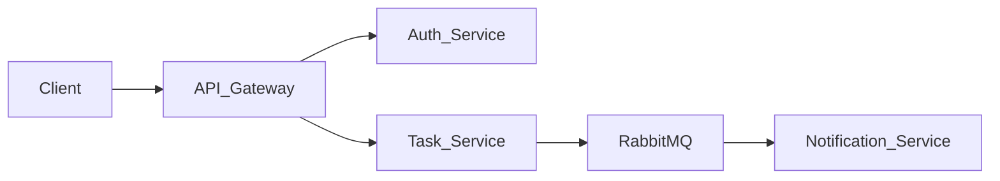

| Öğrenci Adı          | Öğrenci Numarası |
|----------------------|------------------|
| Ahmet Bertan Taşman  | B2180.060012     |
| Zülal Macit          | B2180.060038     |
| Eslem Albayrak       | B2280.060049     |
| Ayhan Bozyurt        | B2180.060058     |

TaskFlow
========

TaskFlow is a simple distributed task management system built as a university assignment.
The main purpose of the project is to demonstrate core distributed systems concepts in a practical,
beginner-friendly way, rather than to create a production-ready application.

The system shows:
- microservice architecture
- service-to-service communication
- API Gateway pattern
- basic authentication and authorization
- asynchronous messaging with RabbitMQ

## Project Overview and Motivation

In many real systems, different responsibilities are separated into independent services that
communicate over the network. TaskFlow is a small example of this idea:

- we split the application into several microservices,
- we put an API Gateway in front as a single entry point,
- we use JWT tokens for authentication and authorization,
- we use RabbitMQ to send events between services.

The project exists to help students:
- understand how microservices can be structured,
- see how an API Gateway can route requests,
- observe how authentication works with JWT,
- see an example of event-driven communication between services.

## Architecture Summary

At a high level, the architecture looks like this:

- **Client** (e.g. Postman, curl) sends all HTTP requests to the **API Gateway**.
- The **API Gateway** forwards authentication requests to the **Auth Service**,
  and task-related requests to the **Task Service**.
- The **Task Service** publishes `task_created` events to **RabbitMQ**.
- The **Notification Service** listens to these events and logs a message.

Ports used (from `PROJECT.md`):
- API Gateway: `4000`
- Auth Service: `4001`
- Task Service: `4002`
- Notification Service: `4003`
- RabbitMQ: `5672`
- RabbitMQ Management UI: `15672`

### Architecture Diagram



## Services and Responsibilities

### API Gateway (port 4000)
- Acts as the **single entry point** for all client requests.
- Forwards `/auth/*` requests to the Auth Service.
- Forwards `/tasks/*` requests to the Task Service.
- Applies a simple JWT check before allowing access to task routes.

### Auth Service (port 4001)
- Handles **user registration**.
- Handles **user login**.
- Generates and returns a **JWT token** on successful login.
- Stores users in memory (no external database, suitable for an MVP).

### Task Service (port 4002)
- Provides **task management**:
  - `GET /tasks` – list tasks.
  - `POST /tasks` – create a new task.
- Protects all task endpoints using JWT (only authenticated users can access them).
- Publishes a `task_created` event to RabbitMQ whenever a new task is created.
- Stores tasks in memory for simplicity.

### Notification Service (port 4003)
- Connects to RabbitMQ.
- Listens for `task_created` events from the Task Service.
- Logs a message: `"Notification received: new task created"` whenever such an event is received.

### RabbitMQ
- Acts as a **message broker**.
- Enables asynchronous communication between the Task Service and the Notification Service.
- Exposes:
  - port `5672` for messaging,
  - port `15672` for the management UI (default user/password: `guest` / `guest`).

## Communication Design

### Client to System
- The client communicates **only** with the API Gateway at `http://localhost:4000`.
- The client never calls the internal services directly.

### API Gateway to Services
- The API Gateway calls:
  - Auth Service via REST (e.g. `/auth/register`, `/auth/login`).
  - Task Service via REST (e.g. `/tasks`).

### Service-to-Service via RabbitMQ
- When a new task is created in the Task Service:
  - the Task Service publishes a `task_created` event to a RabbitMQ exchange,
  - the Notification Service consumes the event from RabbitMQ,
  - the Notification Service logs that a new task was created.

This pattern demonstrates **event-driven communication** between microservices.

## Authentication and Authorization

### Authentication

Authentication is based on **JSON Web Tokens (JWT)**.

- Users register by calling `POST /auth/register` with a username and password.
- Users log in by calling `POST /auth/login`.
- On successful login, the Auth Service returns a JWT token in the response.

The services share a simple `JWT_SECRET` value (via environment variables) so that the
Auth Service can sign tokens and the Task Service can verify them.

### Authorization

Authorization is applied on task-related endpoints.

- To access `/tasks` routes, the client must send the JWT token in the HTTP header:
  - `Authorization: Bearer <jwt_token_here>`
- If the token is missing or invalid, the request is rejected with `401 Unauthorized`.
- If the token is valid, the request is forwarded to the Task Service, which also checks the token.

For the MVP, we keep roles minimal. The main difference is simply:
- **authenticated** users (with a valid token) can create and list tasks,
- **unauthenticated** users cannot access task endpoints.

## Tech Stack and Constraints

- Node.js + Express for all services.
- RabbitMQ for asynchronous messaging.
- Docker + Docker Compose for local orchestration.
- In-memory storage for users and tasks (no external database).
- Shared JWT secret for simplicity.

These choices follow the **technical simplicity rules**:
- do not over-engineer,
- keep code readable,
- prioritize a working demo over complexity.

## Running the Project with Docker

### Prerequisites

- Docker
- Docker Compose (usually included with recent Docker Desktop)

### Starting the system

From the project root, run:

```bash
docker compose up --build
```

This will:
- build Docker images for all services,
- start:
  - API Gateway on `http://localhost:4000`
  - Auth Service on `http://localhost:4001`
  - Task Service on `http://localhost:4002`
  - Notification Service on `http://localhost:4003`
  - RabbitMQ Management UI on `http://localhost:15672` (user: `guest`, password: `guest`)

### Stopping the system

To stop and remove the containers:

```bash
docker compose down
```

## Environment Variables

The services use environment variables for configuration (JWT secret, RabbitMQ URL, and internal service URLs).
You can start from:

```bash
cp .env.example .env
```

Key variables:
- `JWT_SECRET`: Auth Service signs JWT tokens with this secret, and Task Service verifies them.
- `RABBITMQ_URL`: RabbitMQ connection string used by Task Service and Notification Service.
- `AUTH_SERVICE_URL`, `TASK_SERVICE_URL`: Internal URLs used by API Gateway to forward requests (inside Docker).

## Example API Endpoints (via API Gateway)

In the examples below, all requests are sent to the **API Gateway** at `http://localhost:4000`.

### 1. Register a new user

- **Endpoint**: `POST /auth/register`
- **Request body**:

```json
{
  "username": "testuser",
  "password": "123456"
}
```

- **Expected response**:

```json
{
  "message": "User registered successfully"
}
```

### 2. Log in and get a JWT token

- **Endpoint**: `POST /auth/login`
- **Request body**:

```json
{
  "username": "testuser",
  "password": "123456"
}
```

- **Expected response**:

```json
{
  "token": "jwt_token_here"
}
```

The value of `jwt_token_here` will be a real JWT string generated by the Auth Service.

### 3. List tasks (protected)

- **Endpoint**: `GET /tasks`
- **Headers**:
  - `Authorization: Bearer <jwt_token_here>`

- **Example response**:

```json
[
  {
    "id": 1,
    "title": "Finish assignment"
  }
]
```

### 4. Create a new task (protected)

- **Endpoint**: `POST /tasks`
- **Headers**:
  - `Authorization: Bearer <jwt_token_here>`
- **Request body**:

```json
{
  "title": "Finish assignment"
}
```

- **Example response**:

```json
{
  "message": "Task created successfully",
  "task": {
    "id": 1,
    "title": "Finish assignment"
  }
}
```

When this endpoint is called, the Task Service also publishes a `task_created` event to RabbitMQ,
and the Notification Service logs a message when it receives the event.

## Expected Demo Flow

The following steps can be used as a short demo for a presentation:

1. **Start the system**
   - Run `docker compose up --build`.
   - Wait until all services are running.
2. **Check the API Gateway health**
   - Call `GET http://localhost:4000/health`.
   - Show that the gateway responds with a simple JSON status.
3. **Register a user**
   - Call `POST http://localhost:4000/auth/register` with a new username and password.
4. **Log in and get a token**
   - Call `POST http://localhost:4000/auth/login` with the same credentials.
   - Copy the returned JWT token from the response.
5. **List tasks (should be empty or minimal)**
   - Call `GET http://localhost:4000/tasks` with the `Authorization: Bearer <token>` header.
6. **Create a new task**
   - Call `POST http://localhost:4000/tasks` with `{"title": "Finish assignment"}` and the same `Authorization` header.
   - Show that the response contains a new task.
7. **List tasks again**
   - Call `GET http://localhost:4000/tasks` again to show the created task is now returned.
8. **Show notification logs**
   - Look at the logs of the Notification Service container.
   - Highlight the line: `Notification received: new task created`.

During the demo you can connect each step to the theory:
- calling the **API Gateway**,
- authenticating and getting a **JWT**,
- accessing **protected microservice endpoints**,
- seeing **asynchronous events** and **notifications** through RabbitMQ.

## Running Tests

Tests are written with Jest + Supertest and run at the repository root:

```bash
npm test
```

The tests mock RabbitMQ publishing so they do not require a running RabbitMQ container.

## CI/CD Pipeline (GitHub Actions)

This repository includes a GitHub Actions workflow at `.github/workflows/ci.yml`.
On every push and pull request to `main`, it runs:

- `npm ci`
- `npm test`

It also runs `docker compose build` as an optional lightweight build check.

