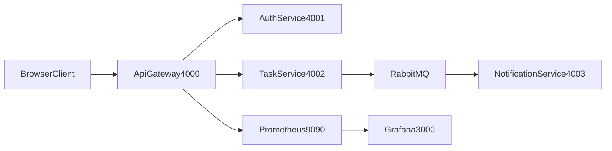

# TaskFlow - Microservice Task Management System

TaskFlow is a full-stack, beginner-friendly microservice project that demonstrates secure authentication, task ownership and visibility rules, asynchronous messaging, observability, and a modern plain-JS frontend.

It is designed for university-level software engineering assignments while following practical production patterns.

## Project Summary

TaskFlow includes:

- API Gateway as single public entry point
- Auth Service for register/login with bcrypt + JWT
- Task Service with ownership and visibility-based access control
- Notification Service consuming RabbitMQ events
- Prometheus metrics in every service + Grafana dashboard
- Structured JSON logging + correlation IDs
- Frontend built with plain HTML/CSS/JavaScript (no frameworks)

## Architecture



## Services and Responsibilities

### API Gateway (`:4000`)

- Routes `/auth/*` to Auth Service and `/tasks*` to Task Service
- Applies global rate limiting and stricter limits for auth routes
- Handles CORS and forwards correlation IDs (`x-correlation-id`)
- Returns consistent JSON errors

### Auth Service (`:4001`)

- `POST /register`: creates user with hashed password (`bcrypt`)
- `POST /login`: validates password and returns JWT token
- Uses JWT expiration (`1h`)
- Supports `email`-based login flow

### Task Service (`:4002`)

- Protected task CRUD endpoints with JWT auth
- Stores task model:
  - `id`
  - `title`
  - `description`
  - `status`
  - `visibility` (`private` / `public`)
  - `createdBy` (from authenticated user)
- Enforces ownership rules on update/delete
- Implements filterable listing (`mine`, `public`, `visible`)
- Publishes `task_created` events to RabbitMQ

### Notification Service (`:4003`)

- Subscribes to task events from RabbitMQ
- Logs notification messages with correlation IDs

## Security Features

- Password hashing with `bcrypt` (no plain-text passwords)
- JWT-based authentication with expiration
- Protected routes with clear auth error messages:
  - missing token
  - invalid token
  - expired token
- API Gateway rate limiting:
  - general limiter for all routes
  - stricter limiter for `/auth/login` and `/auth/register`
- Secret/config management via environment variables
- Ownership and access-control enforcement in task operations

## Task Access Control Rules

### Visibility

- `private`: only creator can see
- `public`: all authenticated users can see

### Filters (`GET /tasks`)

- `filter=mine` -> only tasks where `createdBy === currentUser`
- `filter=public` -> only tasks where `visibility === "public"`
- `filter=visible` (default) -> own tasks + public tasks from others

### Ownership Restrictions

- `PATCH /tasks/:id` -> creator only
- `DELETE /tasks/:id` -> creator only
- non-owners receive `403`

## Observability and Reliability

- `GET /health` in all services
- `GET /metrics` in all services (Prometheus format)
- Per-service metrics with labels (method/route/status):
  - total HTTP requests
  - total HTTP errors
  - uptime
- Grafana provisioned with Prometheus datasource and dashboard
- Structured JSON logs:
  - service
  - level
  - message
  - timestamp
  - correlationId
- RabbitMQ retry logic with attempt logging
- Centralized error handlers returning JSON:
  - `{ "message": "Internal Server Error" }`

## Frontend Features (Plain HTML/CSS/JS)

- Login/Register page (`index.html`)
- Dashboard page (`dashboard.html`)
- Create task form with visibility selector
- Task list with:
  - title
  - description
  - status badge
  - visibility badge
  - creator for public tasks
- Task status toggle (`pending` / `completed`)
- Owner-only delete button
- Filtering controls (`All Visible`, `My Tasks`, `Public Tasks`)
- Client-side live search by title
- Progress indicator:
  - total tasks
  - completed tasks
  - completion percentage + progress bar
- Empty states and responsive SaaS-style UI

## API Endpoints (Gateway)

Base URL: `http://localhost:4000`

### Auth

- `POST /auth/register`
- `POST /auth/login`

### Tasks (JWT required)

- `GET /tasks`
- `GET /tasks?filter=mine|public|visible`
- `POST /tasks`
- `PATCH /tasks/:id`
- `DELETE /tasks/:id`

## Getting Started

## 1) Prerequisites

- Docker
- Docker Compose

## 2) Environment Setup

Create a `.env` file using `.env.example` and provide all required values:

- `JWT_SECRET`
- `RABBITMQ_URL`
- `AUTH_SERVICE_URL`
- `TASK_SERVICE_URL`
- service port variables (`API_GATEWAY_PORT`, `AUTH_SERVICE_PORT`, `TASK_SERVICE_PORT`, `NOTIFICATION_SERVICE_PORT`)

## 3) Run with Docker

```bash
docker compose up --build
```

Stop:

```bash
docker compose down
```

## 4) Access URLs

- API Gateway: [http://localhost:4000](http://localhost:4000)
- Frontend (open `index.html` via local static server)
- Prometheus: [http://localhost:9090](http://localhost:9090)
- Grafana: [http://localhost:3000](http://localhost:3000)
- RabbitMQ Management: [http://localhost:15672](http://localhost:15672)

## Running Frontend Locally

If you are not serving static files from a container, run:

```bash
python3 -m http.server 8080
```

Then open the frontend page from `http://localhost:8080`.

## Monitoring Usage

- Prometheus scrapes `/metrics` from each service
- Grafana reads from Prometheus and shows:
  - total requests per service
  - total errors per service
  - uptime per service

## Testing

Run all tests:

```bash
npm test -- --runInBand
```

Current tests cover:

- auth register/login flow
- invalid credential handling
- task visibility filtering
- private-task non-leakage
- owner-only patch/delete restrictions
- normalization behavior for status/visibility

## Reports

- `RELIABILITY_REPORT.md`
- `SECURITY_REPORT.md`

These documents summarize reliability and security improvements implemented in the system.

